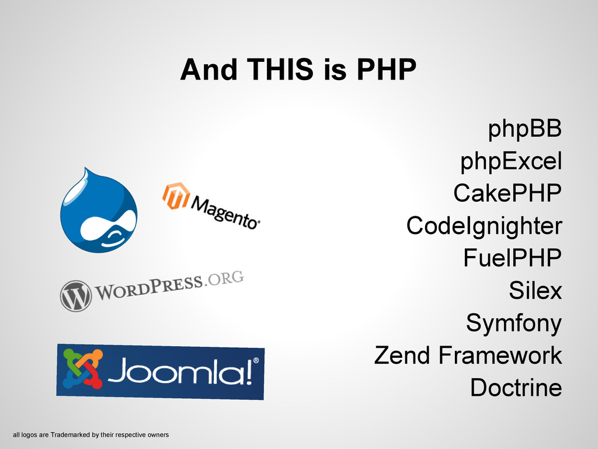
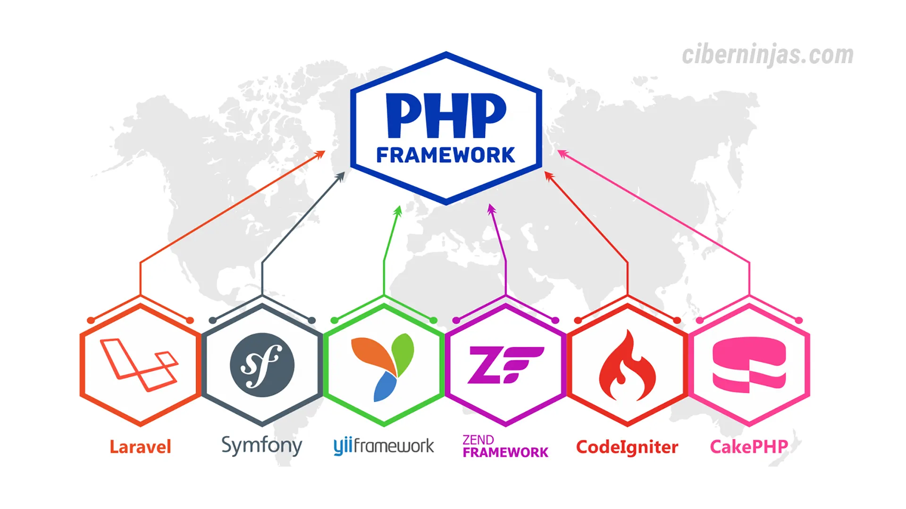
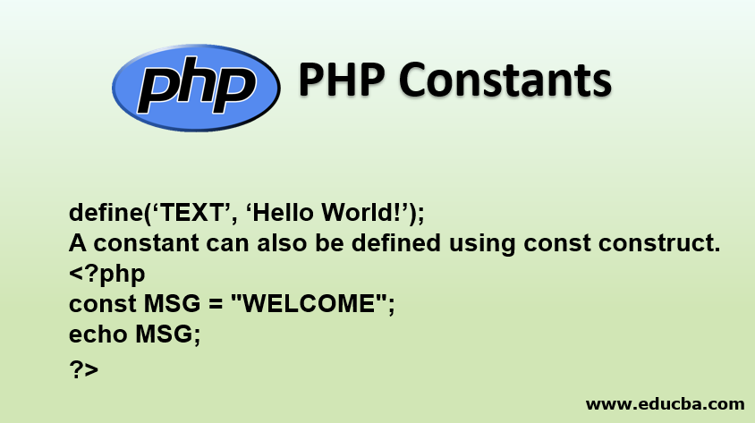
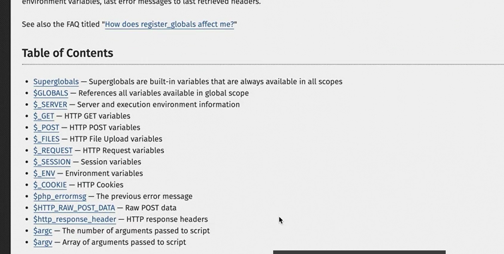

# PHP
* Personal Home Page tools
* hypertext preprocessor
  

# Ecosystem
  
  


# Frameworks
  
  


# language uses
* SSR : server side render applications
* processsing forms
* reading files
* getting data from db
* getting data from services


# echo and print
- there is three ways to print information in php
```php
echo "";
print "";
<?="this is the end"?>
```

# HTML with php
```php
<!DOCTYPE html>
<html lang="es">
<head>
  <meta charset="utf-8"/>
 <meta name="description" content="" />
    <meta name="viewport" content="width=device-width, initial-scale=1" />
    <title></title>
</head>
<body>
  <?php 
    echo "this is my hello world";
   ?>
</body>
</html>
```

# variables
```php
$age = 24;
```

# constants
  

  

- for define a constant you need to call a function, and for call it, you don't need the $ sign, just the constant name

- you can, just define one time, if you try to assign again it will keep the first value

```php
define("VERSION", 1.1);
echo VERSION;
```

```php
define("VERSION", 1.1, true);
echo VERSION;
```

```php
const ~NAME = "";
echo NAME;
```

# Predefined variable
  
```php
$GLOBALS
$_SERVER
$_GET 
$_POST 
$_FILES
$_REQUEST 
$_SESSION 
$_ENV 
$_COOKIE 
$php_errormsg
$http_response_header
$argc
$argv
```

# $GLOBALS
- let you define variables to use cross the whole program
```php
$GLOBALS["name"] = "daniel";
echo $GLOBALS["name"];
```

# $_SERVER
- contains information from server
```php
$_SERVER["DOCUMENT_ROOT"];
$_SERVER["SERVER_PROTOCOL"];
$_SERVER["REQUEST_METHOD"];
$_SERVER["SERVER_NAME"]
$_SERVER["DOCUMENT_ROOT"]
$_SERVER["SERVER_PROTOCOL"]
```

# $_GET
- get params from the request
```php
echo $_GET["name"];
```

# $_POST
- by default it takes the form encode way
```php
echo $_POST["name"]
```

# $_FILES
```php
$_FILES["angular.md"]
```

# $_REQUEST
```php
echo $_REQUEST["name"];
```

# $_SESSION
```php
echo $_SESSION["username"];
```

# $_ENV
```php
echo $_ENV["USER"];
```

# $_COOKIE 
```php
echo $_COOKIE["USER"];
```

# $argc
```php
echo $argc;

```

# $argv
```php
echo implode($argv);
```

# string operations
## implode
```php
$result = implode($_SERVER, "<br/>");
```
# Types
PHP handle the types for us
- integers
- float
- string
- boolean
- array: is use for both, list and dictionary
    - list
    - dict

```php
    $age = 24;
    $weight = 24.3;
    $name = "test";
    $sex = 'm';
    $youThere = true;
    $cars = array("Volvo", "BMW", "Toyota");
    foreach($cars as $car){
        echo $car;
    }

    $human = array(
        "name" => "daniel", 
        "lastname" => "molina"
    );
    foreach ($human as $key => $value) {
        echo $key . ": " . $value . "<br/>";
    } 
```

# strings
## double string
```php
$name = "daniel";
$sentence = "my name is $name";
echo $sentence;
```

## simple string
php does not process it
 - \'
 - \\

```php
$name = "daniel";
$sentence = 'my name is $name';
echo $sentence;
```
## multiline string
 - you could use multiline
```php
$name = "daniel";
$paragraph = <<<EOF
this is my text
{$name}
EOF;
```

## escape characters
```php
\n 
\\ 
\$ 
\t 
```

# array
- key-value pair
- the value and the key could be any object

```php
# numbered keys
$cars = array("Volvo", "BMW", "Toyota"); 

# associate arrays
$human = array(
    "name" => "daniel", 
    "lastname" => "molina"
);
```

## adding elements
```php
$numbers[] = 10;
```

 - you could put a key-value event if is one indexed array
```php
$numbers["name"] = "hjose";
```

## multi-array
```php
$multi = array(
    "daniel" => array(
        "age" => 10,
        "name" => "daniel",
    ),
    "molina" => array(
        "age" => 20,
        "name" => "molina",
    )
);
```

## boolean operator
 - checks value
    - php convert the string to number, and then evaluate
```php
if('1' == 1) { echo 'true'; }
```

 - checks type and value
```php
if(1 === 1) { echo 'true'; }
```

# alternative if
```php
$number = 2;
if($number == 2):
    echo "is two";
elseif($number == 3):
    echo "is three";
else:
    echo "is nothing";
endif;
```

# yoda conditions
- place the variable in the right side, the constant in the left
    - to avoid assignments
    - to avoid null pointer exceptions in some languages

[file](file:b:/php/linkedin_learning_php/app.php)
```php
if(3 == $number) {

}
```

## checking if the variable exists
[file](file:b:/php/linkedin_learning_php/app.php)
```php
if (isset($name)){
  
}
```

 - assign the variable or the value in case the variable is null
[file](file:b:/php/linkedin_learning_php/app.php)
```php
$name = $name ?: "dani";
```
# switch

- if the break is not there, then the switch will continue executing the cases down further

[file](file:b:/php/linkedin_learning_php/app.php)
```php
switch(~){
    case 1:
        echo "is one";
        break;
    default:
        echo "is nothing";
}
```

[file](file:b:/php/linkedin_learning_php/app.php)
```php
$total = 1;
switch($total):
  case 1:
    echo "<br/>this is one";
  case 2:
    echo "<br/>this is two";
  case 3:
    echo "<br/>this is three";
  case 4;
    echo "<br/>this is four";
  default:
    echo "<br/> this is the last default case";
endswitch;
```

# match
```php
$license = "a2";
$driver = match($license){
  "a1" => "low biker",
  "a2" => "high biker",
  "b1" => "car driver",
  default => "unknown",
};
echo $driver; 
```

## match with conditions
```php
$age = 10;
$person = match(true){
  $age < 10 => "child",
  $age > 10 && $age < 50 => "young",
  default => "old men",
};
echo $person;
```

```php
$results = array(
  "a" => 2,
  "b" => 33
);
echo  implode($results);
print_r($results);
```


# loops
```php
$a = 0;
while ($a <= 10) {
  $a++;
  print "$a \n";
}


$i = 0;
for ($i=0; $i < 10; $i++) { 
  echo "$i";
}

$i = 0;
do{
  echo "\n hi $i";
  $i++;
}while($i<10);

$cars = array("mazda" => "10", "toyota" => "corolla");
foreach($cars as $carValue){
  echo  $carName."\n"; 
}
```
### conclusions
foreach go through values instead of keys

# sizeof
useful for arrays

```php
echo sizeof(array(1,2,3)) ;
```

# built-in functions
# substr
```php
count($arrayName)
echo substr("daniel", 2, 3);
```

# date format
```php
echo date("Y-M-d H:m", time());
echo date("F d, j");
```
### conclusions
if you don't send any time, then  php will take time() for you

# strrev
```php
echo strrev("amor");
```

# str_replace
```php
echo str_replace(~source, ~target, ~text);
```

# strtolower
```php
echo strtolower("Daniel");
```

# strtoupper
```php
echo strtoupper("Daniel");
```

# union typing
```php
function double(int|float|null $a){
  return $a * 2;
}
```

# optional and named parameters
```php
function sum($a, $b = 0){
  return $a * $b;
}

echo sum(0,b:3);
```

# anonymous function
```php
$cars = array("Volvo", "BMW", "Toyota");
usort($cars, function($str1, $str2){
  return $str1 <=> $str2;
});
print_r($cars );
```

# class
```php
class Person{
  var $name;
  var $age;
  var $oldPerson = false;

  function __construct($name, $age){
    $this->name = $name;
    $this->age = $age;
  }

  public function set_name($new_name){
    $this->name = $new_name;
  }

  private function update_age($age){
    $this->age = $age * 2;
  }
}
$joe = new Person("daniel", 2);
$rob = new Person("Rob", 5);
echo $joe->name;

$people = array($joe, $rob);

usort($people, function($person1, $person2){
  return $person1->name <=> $person2->name;
});

print_r($people);
```
### conclusions
- the sort function by default is descending
